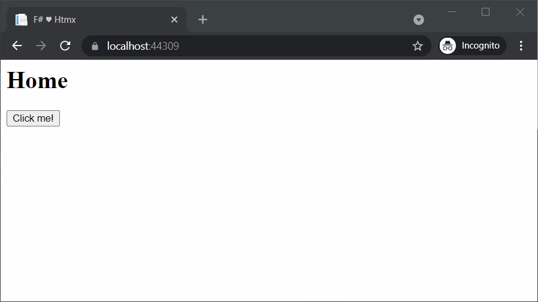

# Feliz.ViewEngine.Htmx [](https://www.nuget.org/packages/Feliz.ViewEngine.Htmx)

A library that allows using [Htmx](https://htmx.org/) attributes with [Feliz.ViewEngine](https://github.com/dbrattli/Feliz.ViewEngine)

### Install from Nuget
```bash
dotnet add package Feliz.ViewEngine.Htmx
```

### Usage
The library exposes the `hx` module and type which are the entry point to the attributes available from HTMX

Here is an example AspNet controller (see `./sample` application) but this library can be used anywhere to render out HTML



```fs
open Microsoft.AspNetCore.Mvc
open Microsoft.Extensions.Logging
open Feliz.ViewEngine
open Feliz.ViewEngine.Htmx

type HomeController (logger : ILogger<HomeController>) =
    inherit Controller()

    (* Utility functions here *)

    member private this.MainLayout (body: ReactElement list) =
        let mainLayout = Html.html [
            Html.head [
                Html.title "F# ♥ Htmx"
                Html.script [ prop.src "https://unpkg.com/htmx.org@1.6.0" ]
                Html.meta [ prop.charset.utf8 ]
            ]

            Html.body body
        ]

        this.Render(mainLayout)

    member this.Clicked() = this.Parial [
        Html.p "Content retrieved by HTMX"
    ]

    member this.Index() = this.MainLayout [
        Html.h1 "Home"
        Html.button [
            hx.post "/Home/Clicked"
            hx.swap.outerHTML
            prop.text "Click me!"
        ]
    ]
```